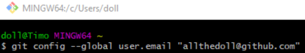

---
#
# Editable - Title and Description display on the page and in HTML meta tags
#
title: Git Configurations
description:
#
# Don't edit items below - they control the page layout
#
return-top: yes
layout: page
page-type: subpage
page-description: yes

# same name for sidebar + pagination include
permalink: /guides/features/git-config
#
---
## What are git configs and why set them up?

Below are the basic configurations needed for Git Bash on Windows, commonly referred to as git configs. These steps are an initial setup that only needs to be completed once per machine or VM.

## Configure username

1. With Git Bash open, enter the following command:
  ```shell
  git config --global user.name “FirstName LastName”
  ```
1. Replace “FirstName” and  “LastName” with your human-readable first and last name.
    

## Configure e-mail

1. With Git Bash open, enter the following command:
  ```shell
  git config --global user.email email@address.com
  ```
1. Replace “email@address.com" with your work e-mail address.
    

## Configure an editor on Windows

With a defined username and email associated with signing your commits, you might want to utilize your favorite editor when writing those commit messages. The following instructions are for individuals using Git Bash when interacting with git repositories.

### Using Atom as your editor

1. Install Atom.
1. Open Git Bash.
1. Enter the following command:
  `git config --global core.editor “atom —wait”`
  

### Using Visual Studio Code as your editor

1. Instal Visual Studio Code.
1. Open Git Bash.
1. Enter the following command:
  `git config --global core.editor “code --wait”`
  

### Eclipse users

1. Install Eclipse with EGit: [https://www.eclipse.org/egit/download/](https://www.eclipse.org/egit/download/)

## Other helpful configs

When you install newer versions of Git Bash on Windows, it will automatically set both of these up for you:

- Set your credential manager for Windows:
  `git config --global credential.helper wincred`
- Windows and Unix operating systems handle line endings differently. You can tell git to automatically fix this issue for you.
  For Windows, you set:
  `git config --global core-autocrlf true`

---

[Return to Guides]({{ site.baseurl }}/guides)
