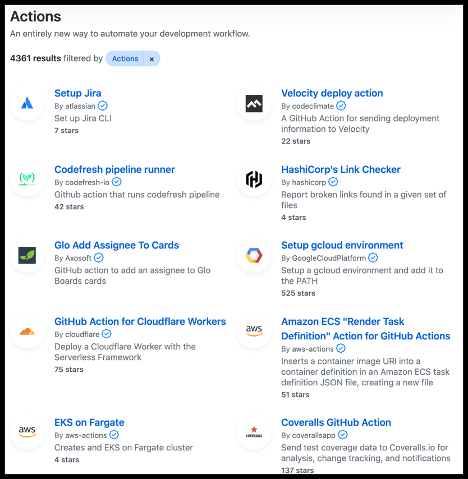

---
#
# Editable - Title and Description display on the page and in HTML meta tags
#
title: GitHub Actions
description: GitHub Actions allow you to automate software development workflows in your repository.
#
# Don't edit items below - they control the page layout
#
return-top: yes
layout: page
page-type: subpage
page-description: yes

# same name for sidebar + pagination include
permalink: /guides/features/github-actions
#
---
## What are GitHub Actions and why should you use them?

GitHub Actions are the way to natively automate things on github.com. It is a great idea to automate things such as version numbering or release notes to help save your team valuable time. Another benefit of automating things such as linters or testing is that it will not only save you time, but also improve the quality of your product/project.

You can either create your very own, or discover existing Actions by other developers in the [Marketplace](https://github.com/marketplace?type=actions).  
  

## Example use cases with GitHub Actions

- [Linters](https://github.com/github/super-linter)
- [Close stale issues](https://github.com/marketplace/actions/close-stale-issues)
- [Release Drafting](https://github.com/marketplace/actions/release-drafter)

## GitHub Actions Basics

An <u>event</u> would trigger a <u>workflow</u> which uses an <u>action</u> to complete the job

<!-- markdownlint-disable -->
| Events | ➡️ | Workflows | ➡️ | Actions |
| ------ | - | --------- | - | ------- |
| Events are essentially webhook events created from activity on GitHub  __Example events:__ - Someone pushes code - A new pull request is opened - A new comment has been posted to an issue | ➡️ | Workflows let you codify useful processes to your liking  They belong in YAML files in a special directory in your repository: `.github/workflows` | ➡️ | Actions are reusable units of code made available to your workflows  GitHub runs them in a Node.js runtime or in Docker containers and are referenced from workflows |
<!-- markdownlint-restore -->

---

[Return to Guides]({{ site.baseurl }}/guides)
