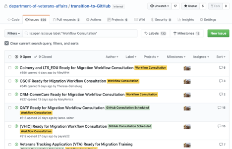
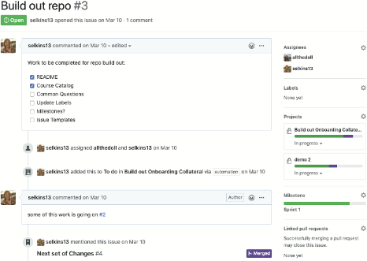

---
#
# Editable - Title and Description display on the page and in HTML meta tags
#
title: GitHub Issues
description: Issues are a quick, easy way to track ideas, enhancements, tasks, notes, or bugs for work on GitHub. You’ll get a notification if an issue is assigned to you, when you're mentioned in a comment, and for each new comment on issues you're following or tagged on.
#
# Don't edit items below - they control the page layout
#
return-top: yes
layout: page
page-type: subpage
page-description: yes

# same name for sidebar + pagination include
permalink: /guides/features/issues
#
---
## What are GitHub issues?

They’re kind of like email—except they can be shared and discussed with the rest of your team. Most software projects have a bug tracker of some kind. GitHub’s tracker is called Issues, and has its own section in every repository.

### You can use issues to

- Collect user feedback
- Report software bugs
- Record meeting notes
- Organize tasks you'd like to accomplish with issues in a repository
- Discuss tactical and strategic points with other stakeholders

### Searching issues

Search and manage your issues more effectively. You can filter your search results by author, label, projects, milestones, assignee, and open/closed state. You can also use the search bar to search for keywords within the content. 
  

## Working with issues

With issues, you can:

- Track and prioritize your work using project boards.
- Create issue templates to help contributors open meaningful issues.
- You can link a pull request to an issue to show that the corresponding work is in progress and to automatically close the issue when someone merges the pull request.
- You can pin up to three important issues above the issues list in your repository.
- You can use task lists to create a list of items with checkboxes within pull request and issue comments. • You can use issue attachments to upload images of proposed features or screenshots of bugs.
- To stay updated on the most recent comments in an issue, you can watch an issue to receive notifications about the latest comments.

## Learn more

For more information on the features of issues and how to use them, please see [Managing your work with issues](https://help.github.com/en/github/managing-your-work-on-github/managing-your-work-with-issues).

---

[Return to Guides]({{ site.baseurl }}/guides)
