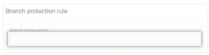

---
#
# Editable - Title and Description display on the page and in HTML meta tags
#
title: GitHub Protected Branches
description: Branch protections prevent users from making irrevocable changes to the branches the protections are configured for, such as for release branches. They are created and managed by repository administrators.
#
# Don't edit items below - they control the page layout
#
return-top: yes
layout: page
page-type: subpage
page-description: yes

# same name for sidebar + pagination include
permalink: /guides/features/protected-branches
#
---
## What are branch protections and why should you use them?

Branch protections prevent users from making irrevocable changes to the branches the protections are configured for, such as for release branches. They are created and managed by repository administrators.  

Working on Github enables collaboration across teams, so multiple people can make commits to the branches within a repository. By default, any pull request can be merged at any time (unless there are other conflicts that prevent merging).

Protecting certain branches adds restrictions on how a pull request can be merged. You'll be able to automatically enforce your repository's security workflow policies without slowing down everyone's ability to collaborate.

### You can use branch protections to

- Require pull request reviews before merging
- Restrict who can make commits on a branch
- Prevent a branch from being accidentally deleted
- Require successful automated checks to pass before the branch can be merged

### Configuring branch protections

To configure branch protections, you will need to be a repository owner, or have administrator permissions for the repository.

For __any__ protected branch, by default:

- The branch cannot be deleted, either accidentally or intentionally
- The branch commit history cannot be overwritten with an alternate set of changes (force push)

Steps to configure branch protection:

1. On GitHub, navigate to the main page of the repository
1. Under the repository name, click the “Settings” tab. If you do not see the “Settings” tab, you do not have permissions.  
    
1. In the left menu, click “Branches”  
  
1. Next to “Branch protection rules”, click “Add rule”  
  
1. Under “Branch name pattern”, type the branch name or pattern you want to protect
    - You can create a branch rule for a specific branch, for all branches, or for any branch that matches a naming pattern (specified with regex syntax).
    - For example, to require any branch containing the word release you would create a branch rule for the branch name pattern using wildcards (\*) on each side:
      - \*release\*  
  
1. Optionally, you can configure specific branch rule settings  
  
1. To confirm you branch protection rule, click “Create” or “Save changes”

## Recommended branch protections for repositories

- Check the __Include administrators__ box at the bottom of the page to also apply this setting to organization and repository administrators
- Enable branch protection on your main production branch or any branch meant for ongoing collaboration. Feel free to skip it for “work in progress” branches, which are meant to be eventually merged and deleted
- Branch protection doesn’t prevent pushing commits which don’t alter the commit history. To disable the ability to push directly to the branch, use the setting __Require pull request reviews before merging__ instead
- Enabled as a required status check for any automation (builds, testing, QA) needed prior to approval of a pull request by using __Enabling required status checks__

## Learn more

For more information on the features of protected branches and how to use them, please see [About Protected Branches](https://docs.github.com/en/github/administering-a-repository/about-protected-branches).

---

[Return to Guides]({{ site.baseurl }}/guides)
