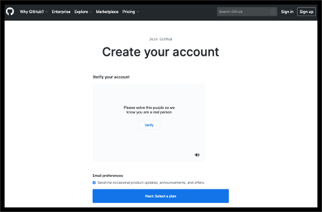
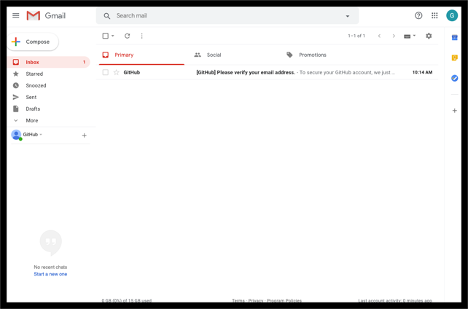
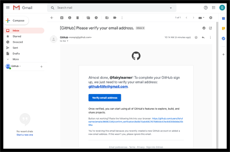
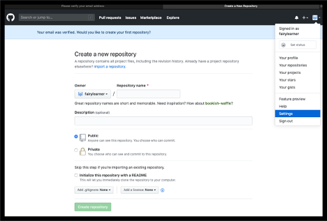
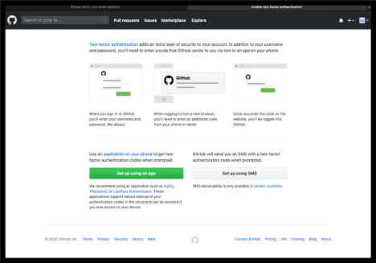
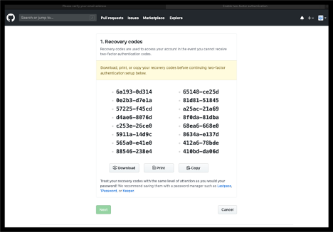
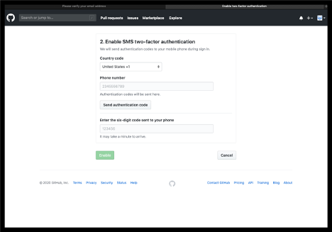
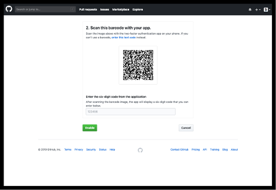
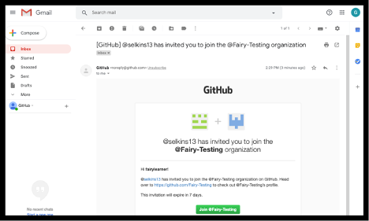
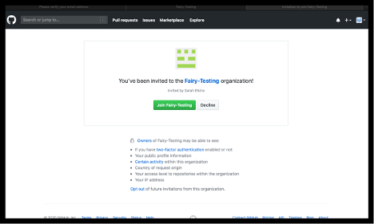

---
#
# Editable - Title and Description display on the page and in HTML meta tags
#
title: Getting Access to the organization
description: If you have colleagues that are having trouble getting access, please share the following steps with them.
#
#
# Don't edit items below - they control the page layout
#
return-top: yes
layout: page
page-type: subpage
page-description: yes

# same name for sidebar + pagination include
permalink: /guides/onboarding/getting-access
#
---
There are several steps that __must__ be done to gain access to the [{{ site.org.name }}]({{ site.org.link }}) organization:

- [Step 1: GitHub.com Account](#step-1-githubcom-account)
- [Step 2: 2-Factor Authentication](#step-2-2-factor-authentication)
- [Step 3: Access to the {{ site.org.name }} Organization](#step-3-access-to-the-{{ site.org.name }}-organization)
- [Step 4: Accepting the Invitation](#step-4-accepting-the-invitation)

## Step 1: GitHub.com Account

If you do not already have a GitHub.com account, please follow the steps outlined below.

If you already have a GitHub.com account, please add and/or verify you have done the following and proceed to [Step 2: 2-Factor Authentication](#step-2-2-factor-authentication):

- Add your company email address, if you have one, to your [GitHub profile emails](https://github.com/settings/emails).
- Add your human readable name to your [GitHub profile](https://github.com/settings/profile).

### Signing up for a GitHub account  

To sign up for a GitHub.com account:

1. Open [https://github.com/join](https://github.com/join) in a web browser.  
  *Note that Chrome, Firefox or Safari are preferred as Internet Explorer and Legacy Edge can have functionality issues.*  
    

1. Fill in the following information:
    - Username
      - This is a unique, personal username for yourself and can be whatever you like, as long as it is not already taken
      - It will be visible to the public
    - Email
      - Use your company email if you have one
      - You can add your personal email address in your profile later
    - Password
      - Your password needs to be unique to the site  
      - It must be at least 8 characters long and include a number and lowercase letters or 16 characters long with any combination of characters
      - As you type your password into the field, it will be obscured for security reasons
      - We recommend you use a password management tool if one is available

1. Once you have an entered an available username, valid email address, and acceptable password, click on the "Sign up or GitHub" button

1. The next page will verify that you are a human and not a robot  
  

1. Click the “Verify” button in the middle of the “Verify your account” box and work the puzzle as instructed

1. Once the puzzle is completed and the site has verified you are a human, select the “Next: Select a Plan” button at the bottom of the screen
    - On this page, you must select a plan.  For the now, please select the “Choose Free” option

     

1. GitHub would now like to know a little more about you as a user.  Please select the information that best describes you and select “Complete Setup” at the bottom of the page  
    

1. Next, GitHub will send you an email to the address you registered.  __You must go to your email and validate it as instructed.__  
    - If you do not find the email in your inbox, be sure to check your Spam/Junk folders
    - Also, if you are using a “Focused” inbox, please be sure to go to your full Inbox if you do not find it as it may have been filtered from view

   

1. Open the email with a subject line stating “[GitHub] Please verify your email address”  
    

1. In the body of the email, you will find a button labeled “Verify email address”. Select this button.  It will open in a separate tab/window  
    

1. Now that you have your GitHub account, please add and/or verify you have done the following and continue to [Step 2: 2-Factor Authentication](#step-2-2-factor-authentication):
    - Add your company email address, if you have one, to your [GitHub profile emails](https://github.com/settings/emails).
    - Add your human readable name to your [GitHub profile](https://github.com/settings/profile).

## Step 2: 2-Factor Authentication

For the {{ site.org.name }}, you must set up Two-Factor Authentication on your GitHub.com account prior to joining. To get this set up, please follow the instructions below.

If you already have a GitHub.com account and have 2FA set up, please proceed to [Step3: Requesting access to the {{ site.org.name }} Organization](#step-3-access-to-the-{{ site.org.name }}-organization).

### Setting up two-factor authentication

Your company requires you to have Two-Factor Authentication enabled on your GitHub.com account prior to joining their organization.  Your GitHub.com account is a personal account, so you will need to utilize your personal phones to do so.

Please follow the steps outlined below to set up your Two-Factor Authentication (2FA).  Be sure to use Chrome, Firefox or Safari for this as there are know functionality issues with Internet Explorer and Legacy Edge.

1. Log into GitHub.com with your personal account  

1. Go to your profile settings page by clicking on your profile icon in the top right of the page to open the drop down and select “Settings”  
    

1. Once you are on your profile settings page, select “Security” in the left menu  
  

1. Select the “Enable two-factor authentication” button in the middle of the page

You now have two options for setting up two-factor authentication:

- [Option 1: SMS text messages](#option-1)
- [Option 2: Authenticator Application](#option-2)

#### OPTION 1

1. If you choose to use text messages (SMS) as your 2FA option, please use the steps below.  If you prefer to a mobile app to setup 2FA, please skip to Option 2.

1. Select the “Set up using SMS” option  
  

1. __Download, print, or save a copy of your recovery codes.  You will not be able to recover your lost account if you do not__  
    

1. Once you have saved you recovery codes, select “Next”

1. Select the correct country code, enter your cell phone number in the field, and select “Send authentication code”  
    

1. Retrieve the code from your cell phone, enter it into the correct field, and select “Enable”

1. You have now completed the 2-Factor Authentication setup via SMS.  Please continue to [Step3: Requesting access to the {{ site.org.name }} Organization](#step-3-access-to-the-{{ site.org.name }}-organization).

#### Option 2

If you choose to use a mobile app to setup 2FA such as ID.me, Authy or Google Authenticator (any app that supports the TOTP protocol will work, so you may already have one of these) follow the steps below.  

1. Select the “Set up using an app” option  
    

1. __Download, print, or save a copy of your recovery codes.  You will not be able to recover your lost account if you do not__  
    

1. Once you have saved you recovery codes, select “Next”

1. Follow the instructions provided by your app to scan the code  
  

1. Then confirm your setup by typing one of the 2FA numbers it provides.  

1. You have now completed the 2-Factor Authentication setup via mobile app.  Please continue to [Step3: Requesting access to the {{ site.org.name }} Organization](#step-3-access-to-the-{{ site.org.name }}-organization).

## Step 3: Access to the {{ site.org.name }} Organization

Once you have your GitHub.com account and have set up 2FA, you will need to request access to the {{ site.org.name }} organization.  You or someone who has access to the requesting site may need to request your access.

## Step 4: Accepting the Invitation

Once you have requested access, you will receive an email from GitHub.com to accept the invitation to the {{ site.org.name }} organization. Please follow the steps below to complete this.

### Accepting your invitation to the organization

To accept your invitation to the {{ site.org.name }} organization within GitHub.com:

1. Open the invitation email you received.  __It could be located in your Inbox, External box, Spam/Junk__
  

1. Click on the “Join @…” link in the body of the email  
  

1. If you cannot find the invitation in your email, you can navigate directly to the organization’s page and select “View invitation”  
  

1. Select “Join …” for the organization want to join.  
  

1. You have now joined the organization and can be added to repositories and teams by the repository administrators.

---

[Return to Guides]({{ site.baseurl }}/guides)
