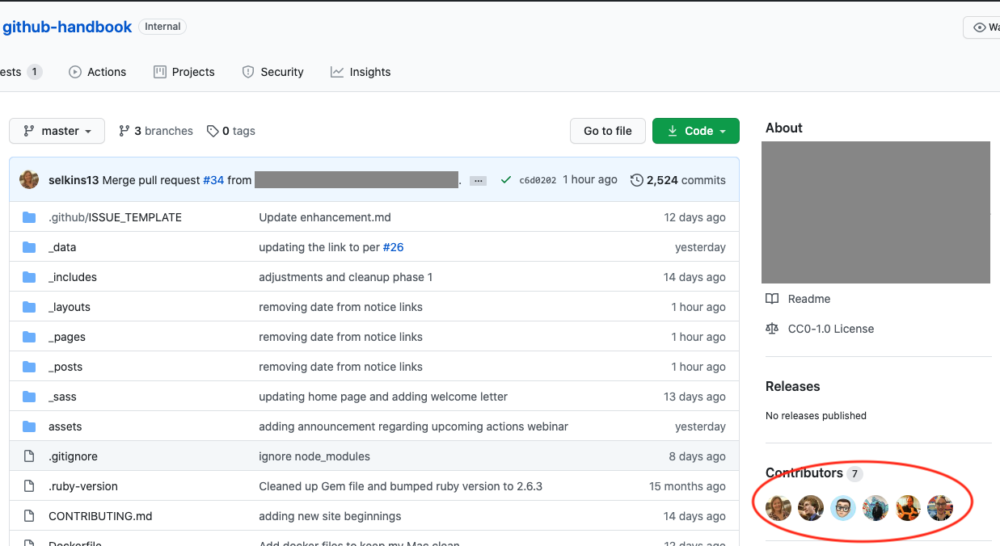
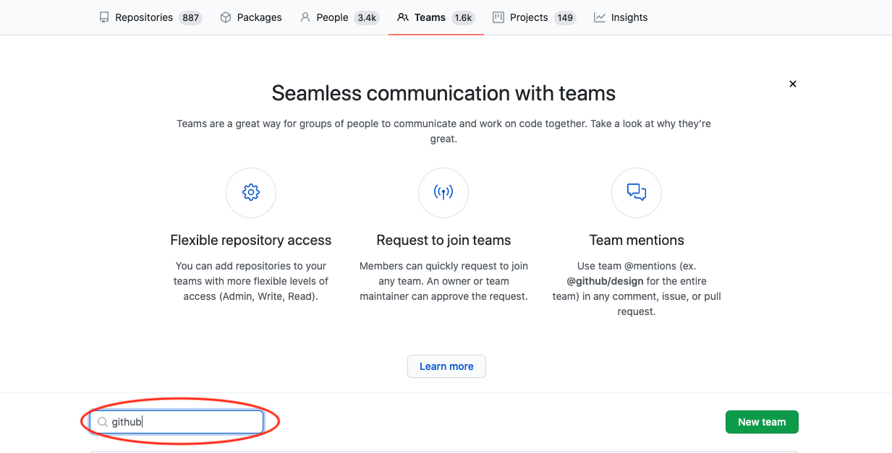
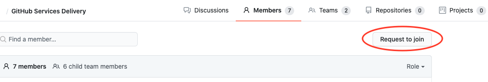

---
#
# Editable - Title and Description display on the page and in HTML meta tags
#
title: Requesting Repository/Team Access
description: Requesting access to certain repositories or teams can be daunting.  Please use this guide to help you navigate whom you should ask.
#
# Don't edit items below - they control the page layout
#
return-top: yes
layout: page
page-type: subpage
page-description: yes

# same name for sidebar + pagination include
permalink: /guides/onboarding/requesting-repo-access
#
---
When trying to gain access to the repositories you need, there are two ways to find out whom to contact:

- [Search for the Repository](#search-for-the-repository)  
- [Search for Teams](#search-for-teams)  
- [Team Maintainers](#team-maintainers)  

## Search for the Repository

The `README.md` files in a repository can portray a lot of information, including how to get access, to users.  When searching for repositories, you will only be able to see any `public` or `internal` repositories, you will not be able to see `private` repositories.  

To search for the needed repositories to see if this information is in it's `README.md`, please do the following:

1. Navigate to the [{{ site.org.name }}]({{ site.org.link }}) organization
1. In the "Find a repository..." box, type the name of the product you need access to
    

1. Select the repository from the search results if the one you need is there  
    

1. View the repository's `README.md` file to see if there is mention of how to join the team.  
  

1. If there is no information in the `README.md` file, you can look at the contributors to the repository and message one of them.  
  

1. Another option is to submit an issue in the repository requesting access (if issues are enabled on the repository).  
  

## Search for Teams

Another option is to search for teams associated with the product you need access to.  When searching for teams, you will only be able to see teams marked as `visible`.  

To search for teams, please do the following:

1. Navigate to the [{{ site.org.name }}]({{ site.org.link }}) organization

1. Select the `Teams` tab  
    

1. In the "Find a team..." box, type in the product team you are searching for  
    

1. Select the needed team and navigate to the `Members` tab of the team page  
    

1. Select the "Request to join" button  
    

## Team Maintainers

If you need to add a maintainer to a repository, there are two options. If there is a team maintainer already, then that person can add a new one. Otherwise, you should reach out on the [Contact us]({{ site.baseurl }}/contact) page so that an administrator can do that for you.

## Still need help?

If you still need help, please feel free to [Contact us]({{ site.baseurl }}/contact).

---

[Return to Guides]({{ site.baseurl }}/guides)
