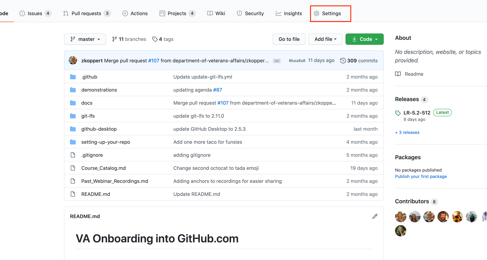
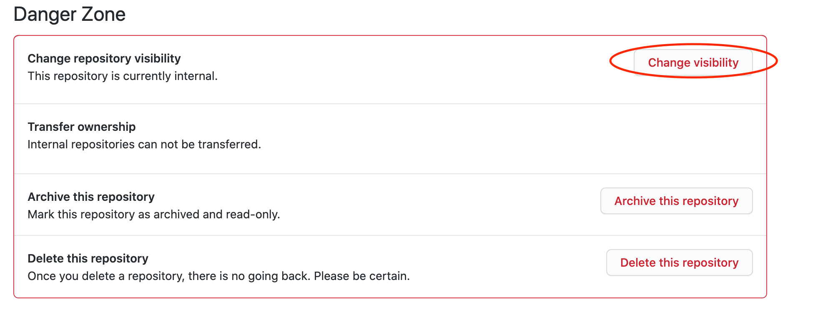

---
#
# Editable - Title and Description display on the page and in HTML meta tags
#
title: Change Repo Visibility
description: Organization Owners can change the visibility of repositories.  Step by step instructions below.
# Don't edit items below - they control the page layout
#
return-top: yes
layout: page
page-description: yes
sidebar: guides
permalink: guides/org-admin/change-repo-visibility
#
---
*Note*: Official documentation is located [here](https://docs.github.com/en/github/administering-a-repository/setting-repository-visibility#changing-a-repositorys-visibility).  

## Changing Repo Visibility

1. Navigate to the repository in you are attempting to change visibility of
1. Click `Settings`

1. Scroll down to the bottom of the page
1. Click `Change visibility`

1. Click the radio button selecting the new visibility
1. Type in the full name of the repository including the organization name
1. Click `I understand, change repository visibility.`

---

[Return to Guides]({{ site.baseurl }}/guides)
