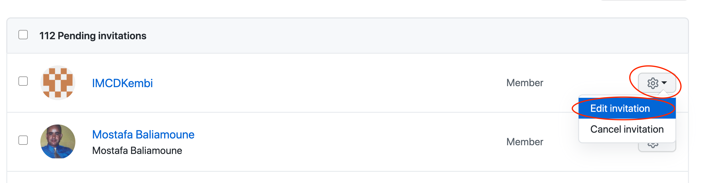

---
#
# Editable - Title and Description display on the page and in HTML meta tags
#
title: Reviewing Pending Invites
description: Any user that has been sent an invitation will be listed in the Pending Invitations section of the organization's `People` page.
#
# Don't edit items below - they control the page layout
#
return-top: yes
layout: page
page-description: yes
sidebar: guides
permalink: guides/org-admin/pending-invites
#
---
### Review Pending Invites

Often it is useful to determine if a user has an invite pending and who invited them.  Official documentation is located [here](https://docs.github.com/en/github/setting-up-and-managing-organizations-and-teams/canceling-or-editing-an-invitation-to-join-your-organization).

* Open the [{{ site.org.name }}]({{ site.org.link }}) organization
* Navigate to *People*

* Navigate to *Pending Invitations*

* Look through the pending invites to find the user in question
* Select the *Gear* icon next to the user
* Select *Edit invitation* from the new dropdown

* Review the invite, notice in the description on top that it tells you who made the initial invite

---

[Return to Guides]({{ site.baseurl }}/guides)
