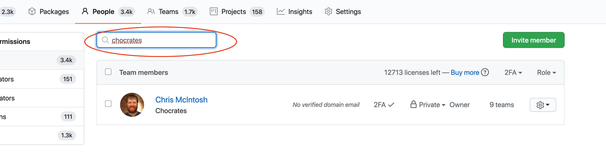

---
#
# Editable - Title and Description display on the page and in HTML meta tags
#
title: Removing Users
description: Users will be removed from the organization on GitHub.com according to "User Retention Policy".
#
# Don't edit items below - they control the page layout
#
return-top: yes
layout: page
page-description: yes
sidebar: guides
permalink: guides/org-admin/removing-users
#
---
### Removing Users Through *People*

Official documentation on inviting users can be found [here](https://docs.github.com/en/github/setting-up-and-managing-organizations-and-teams/removing-a-member-from-your-organization).

* Open the [{{ site.org.name }}]({{ site.org.link }}) organization
* Navigate to *People*

* Type in part of the name of the user you are removing into the search bar

* Click the gear icon next to the user you are removing
* Click *remove from organization...*

---

[Return to Guides]({{ site.baseurl }}/guides)
