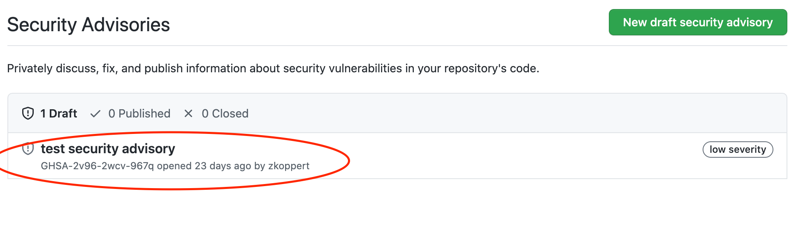
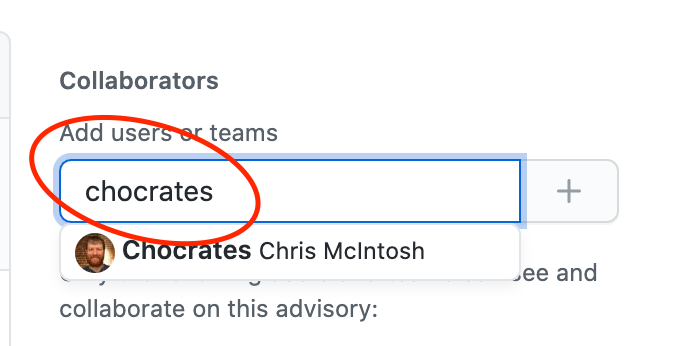
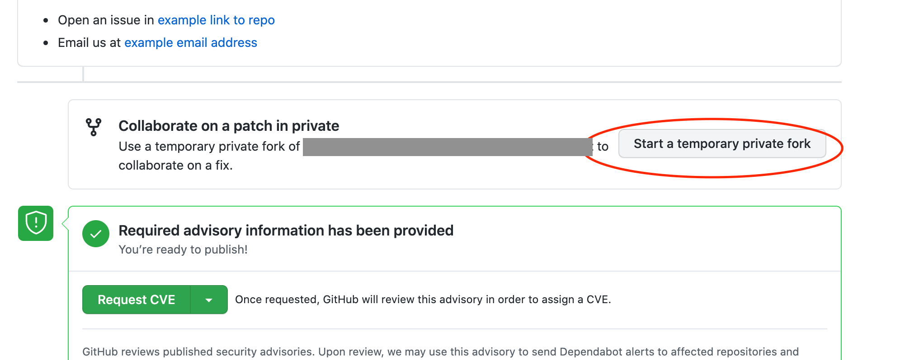
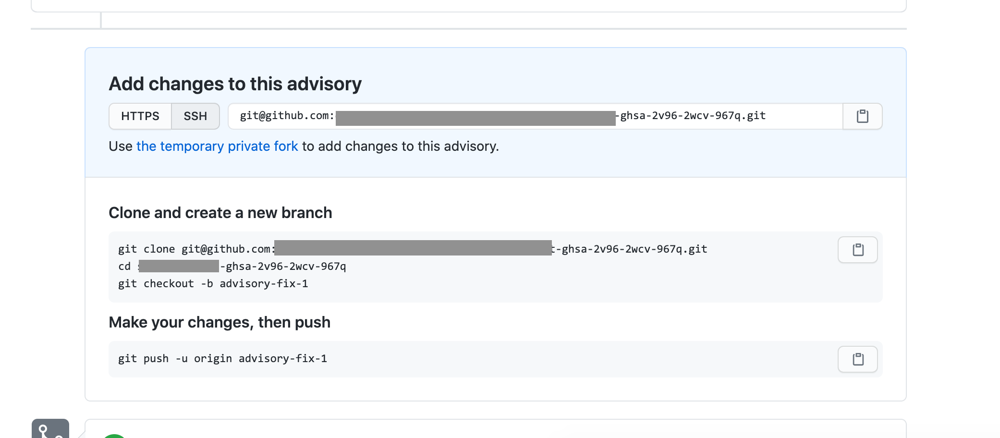
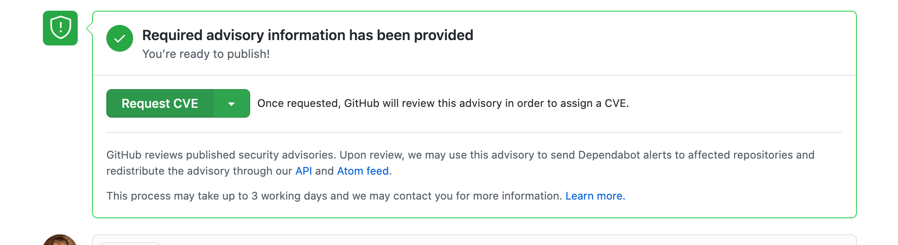

---
#
# Editable - Title and Description display on the page and in HTML meta tags
#
title: Security Advisories
description: GitHub security advisories are a tool that repository maintainers can use to privately identify, discuss, fix, and publish information related to security vulnerabilities within a project.
#
# Don't edit items below - they control the page layout
#
return-top: yes
layout: page
page-description: yes
sidebar: guides
permalink: guides/security/advisories
#
---
See [official documentation](https://docs.github.com/en/github/managing-security-vulnerabilities/about-github-security-advisories) for full details.

#### Table Of Contents

1. [Drafting a new Security Advisory](#drafting-a-new-security-advisory)
1. [Adding Collaborators](#adding-collaborators)
1. [Publishing](#publishing)
    - [Requesting a CVE](#request-a-cve)
    - [Publish Advisory](#publish-advisory)

## Drafting a new Security Advisory

See the [GitHub docs](https://docs.github.com/en/github/managing-security-vulnerabilities/creating-a-security-advisory) for full details

1. Navigate to your repository
1. Click `Security`  

1. Click `Security advisories`  

1. Click `New draft security advisory`  

1. Fill out the form attributes and click `Create security advisory`  

## Adding Collaborators

See the [GitHub docs](https://docs.github.com/en/github/managing-security-vulnerabilities/adding-a-collaborator-to-a-security-advisory) for full details

1. Navigate to your repository
1. Click `Security`  

1. Click `Security advisories`  

1. In the "Security Advisories" list find the advisory you would like to add users to  

1. On the right side of the screen find the `Collaborators` section
1. Search for a user name and select the `+` button  

## Creating Private Forks

See the [GitHub docs](https://docs.github.com/en/github/managing-security-vulnerabilities/collaborating-in-a-temporary-private-fork-to-resolve-a-security-vulnerability) for full details

1. Navigate to your repository
1. Click `Security`  

1. Click `Security advisories`  

1. In the "Security Advisories" list find the advisory in which you would like to create a fork  

1. At the bottom right of the page click the `Start a temporary private fork` button  

1. GitHub will create a fork in the background and finally give you details on how to clone and work on the new private fork  

## Publishing

### Request a CVE

First you will need to request a CVE from GitHub.  [Official documentation](https://docs.github.com/en/github/managing-security-vulnerabilities/publishing-a-security-advisory#requesting-a-cve-identification-number) on requesting a CVE.

1. Navigate to your repository
1. Click `Security`  

1. Click `Security advisories`  

1. In the "Security Advisories" list find the advisory in which you would like to create a fork  

1. At the bottom left of the page click the `Request CVE` button  

### Publish Advisory

First you will need to request a CVE from GitHub.  [Official documentation](https://docs.github.com/en/github/managing-security-vulnerabilities/publishing-a-security-advisory#publishing-a-security-advisory) on requesting a CVE.

1. Navigate to your repository
1. Click `Security`  

1. Click `Security advisories`  

1. In the "Security Advisories" list find the advisory in which you would like to create a fork  

1. Finally click the `Publish advisory` button on the bottom left, in the same spot that `Request CVE` was  

---

[Return to Guides]({{ site.baseurl }}/guides)
