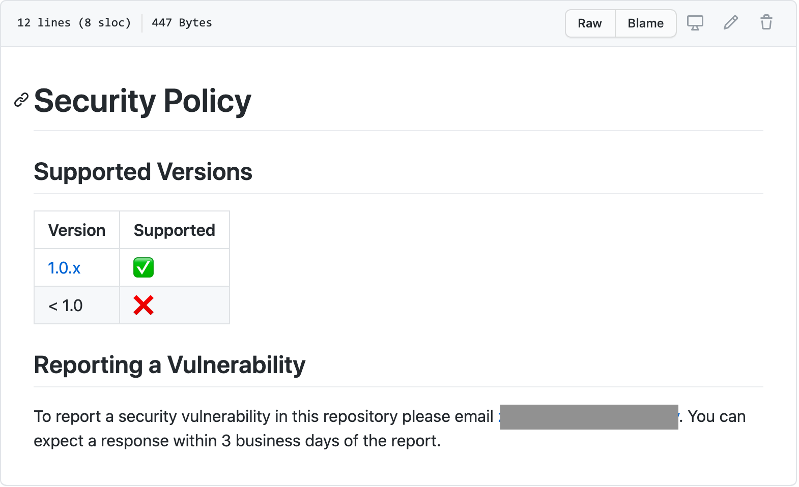
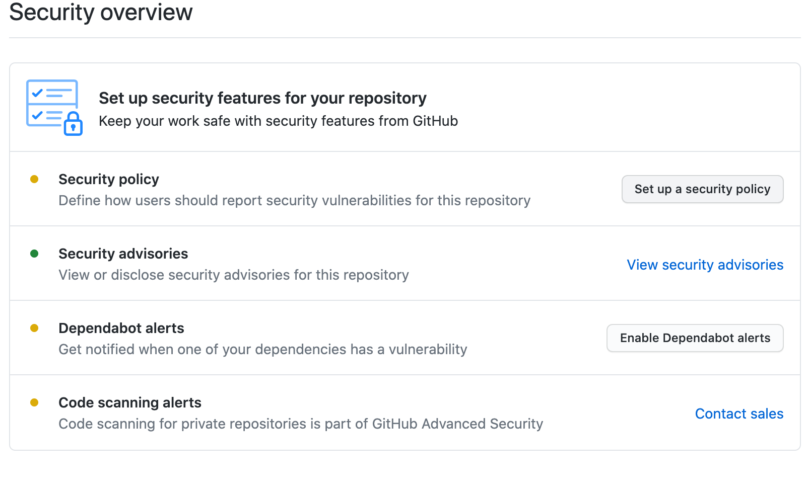

---
#
# Editable - Title and Description display on the page and in HTML meta tags
#
title: Security Policy
description: A Security Policy is a repository’s `SECURITY.MD` file which describes everything auditors and users need to report a potential vulnerability.
#
# Don't edit items below - they control the page layout
#
return-top: yes
layout: page
page-description: yes
sidebar: guides
# same name for sidebar + pagination include
#sidebar-page-type: /tldrs-and-guides
permalink: guides/security/security-policy
#
---
The recommendation is that **every repository containing code** has a `Security.md` file.

## Examples

## Create a policy

To create a security policy from the template

1. Navigate to your repository on [{{ site.org.name }}]({{ site.org.link }})
1. Click on the "Security" tab  
  
1. Click on "Setup a security policy"  
  

---

[Return to Guides]({{ site.baseurl }}/guides)
